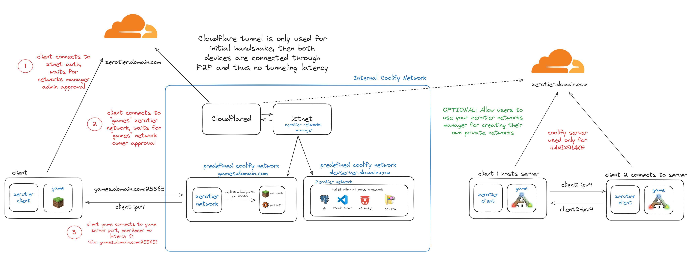

# ZTNET + Coolify Integration for ZeroTier-only Minecraft Server (or any game/service server)

This guide explains how to deploy ZTNET (a ZeroTier controller) and a Minecraft server that is only accessible via ZeroTier, using Coolify.



Project started as a discussion in the [Coolify Community Discord](https://discord.com/channels/459365938081431553/1374877251908272239/1375489331569102908), where attempts to use Cloudflare Tunnels introduced high latency for Minecraft gameplay.

This setup ensures low-latency connections by leveraging ZeroTier's peer-to-peer architecture. It doesn't require exposing your server to the public internet, port forwarding, or any messy configurations; just pure docker!

## Project Structure

- The main ZTNET controller is defined in `docker-compose.yml`.

Two example minecraft-related Docker Compose files are provided:

- `minecraft-docker-compose.yml`: bare minimum setup for a Minecraft server accessible only via ZeroTier. This is included so that you can swap out the Minecraft server for any other game server or service you want to run on ZeroTier.
- `minecraft-full-docker-compose.yml`: includes additional must-have services for minecrafters, such as a web-based file manager (File Browser) and easy backups (itzg/minecraft-backup), which allows you to mod the games easily and manage files via a web UI.

in both cases, you can access server's terminal by targeting the minecraft container in Coolify and executing "rcon-cli". Then you can run commands e.g. "op <your_username>" to make yourself an operator.

## ZTNET (ZeroTier Controller)

Deploy `docker-compose.yml` as a Docker Compose service in Coolify.
This can be safely exposed through coolify and a Cloudflare tunnel. For our setup, we have Cloudflared running as a separate Coolify service exposing ZTNET's web UI.

## Any game server (Minecraft Server in this case) (ZeroTier-only access)

Deploy `minecraft-full-docker-compose.yml` as a Docker Compose service in Coolify.

### Required environment variable

| Variable              | Description                         | Example            |
| --------------------- | ----------------------------------- | ------------------ |
| `ZEROTIER_NETWORK_ID` | Your ZeroTier network ID from ZTNET | `a1b2c3d4e5f6g7h8` |

### Setup Server

1. Deploy ZTNET first and create a network
2. Copy the Network ID from ZTNET
3. In Coolify, add environment variable:
   - **Name:** `ZEROTIER_NETWORK_ID`
   - **Value:** Your network ID
4. Deploy the Minecraft service
5. Authorize the new member in ZTNET
6. Note the ZeroTier IP assigned to the Minecraft member
7. Connect to Minecraft via the ZeroTier IP: `<ZEROTIER_IP>:25565`

### Setup Clients (Players)

1. Install ZeroTier on your gaming device (PC, console, etc.)
2. Join the ZeroTier network created in ZTNET using the Network ID
3. Authorize the new member in ZTNET
4. Connect to Minecraft via the ZeroTier IP of the server: `<ZEROTIER_IP>:25565`

### Custom domain (optional)

To use a custom domain like `minecraft.example.com`:

1. In ZTNET, assign a static IP to the Minecraft member (to prevent IP changes)
2. In Cloudflare (or your DNS provider), add an A record:

   | Type | Name      | Value                                  |
   | ---- | --------- | -------------------------------------- |
   | A    | minecraft | `<ZEROTIER_IP>` (e.g., `10.121.15.79`) |

3. Connect using: `minecraft.domain.com`

This works because the domain resolves to a private ZeroTier IP - only devices on your ZeroTier network can reach it.

### Network isolation (optional)

By default, all ZeroTier members can communicate with each other. To restrict traffic so members can only reach the Minecraft server (not each other), replace the default Flow Rules in ZTNET with:

```
# Allow only IPv4, IPv4 ARP, and IPv6 Ethernet frames.

drop
not ethertype ipv4
and not ethertype arp
and not ethertype ipv6
;

# Drop client <-> client (IPv4)

drop
ethertype ipv4
and not ipsrc <mc_server_ip>/32
and not ipdest <mc_server_ip>/32
;

# Drop client <-> client (IPv6)

drop
ethertype ipv6
and not ipsrc <mc_server_ip>/128
and not ipdest <mc_server_ip>/128
;

# Accept everything else

accept;

```

Replace `<MINECRAFT_ZEROTIER_IP>` with your Minecraft server's ZeroTier IP (e.g., `10.121.15.79`).

### Optional Minecraft variables

All standard [itzg/minecraft-server](https://github.com/itzg/docker-minecraft-server) variables are supported. Consult the docs as they go into deep detail for how to add mods, plugins, and configure the server.
